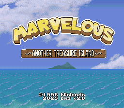
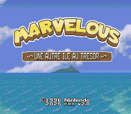

# Marvelous \~Another Treasure Island\~ Translation

This is a translation project of Marvelous \~Mōhitotsu no Takarajima\~ (マーヴェラス ～もうひとつの宝島～).
Original Translation Project by tashi and DackR. This project is aimed to massively improve the translation as well as making it easier to edit, it used the original files from the project as a base.

Currently being translated in English & French.  

## Staff
- LuigiBlood - Project Leader, Code Hacking, Graphics, Text Editing (English & French)
- /dev/urandom - Font Design

English Version:
- tashi - Original Japanese to English Text Translation
- DackR - English Text Editing, Graphics
- bluesun - English Retranslation, 

French Version (based from the works of the English Version):
- pinktagada - French Text Translation
- Lestat - French Graphics, Translation

Special Thanks:
- FuSoYa - For dealing with the compression
- terminator2k2 - For giving us some save files
- NukeOTron

Original Translation Project by: tashi & DackR

## Debugging
A Lua script for Mesen has been provided , which tells on screen which text ID is being managed, as well as recalculating the text pointers as they are generated at boot by the game. The recalculation works in a way that allows us to use save states across several versions of the ROM, making it a lot easier to do quick debugging of changes.

The `_play_*.bat` files included expect `./tools/Mesen/Mesen.exe`.

## Building
### Requirements
- bass (ARM9 fork): https://github.com/ARM9/bass
  - Must be in `./tools/bass/`.
  - Tested with bass v18
- Lunar Compress: http://fusoya.eludevisibility.org/lc/index.html
  - Must be in `./tools/lc/`.
  - Tested with Lunar Compress 1.90
- SuperFamiconv: https://github.com/Optiroc/SuperFamiconv
  - Must be in `./tools/conv/`.
- TransPutt: https://github.com/LuigiBlood/TransPutt
- PuttScript: https://github.com/LuigiBlood/PuttScript
  - Both must be in `./tools/putt/`.
  - Must contain `marvelous` folder
- Put the original ROM as `./roms/Marvelous_JP.sfc` (SHA-1: `46FE42F195D43B71BA0608356EB7C2B65BFF70AC`)

### Command Order
For several reasons, I have opted to seperate the build process in several steps, as changes don't always need to pass through every step.  
You can replace `**` with either `en` (English) or `fr` (French).

- `_jp_extract.bat` 
  - **DO IT FIRST!** Extracts and decompresses every compressed data from the original ROM with Lunar Compress.
  - The build process uses those files as a base. You only need to do it once.
- `_**_0build_gfx.cmd` 
  - Converts PNG images into SNES format and inserts them into files.
  - If you have made graphical changes, do this step.
- `_**_0build_script.cmd` 
  - Copies script files from TransPutt and builds script binaries.
  - If you have made text changes, do this step.
- `_**_1lz.bat`
  - Compresses graphics with Lunar Compress.
  - If you have made graphical changes, do this step.
- `_**_2build.bat`
  - Build the ROM + ROM with (lazy) PAL conversion code
